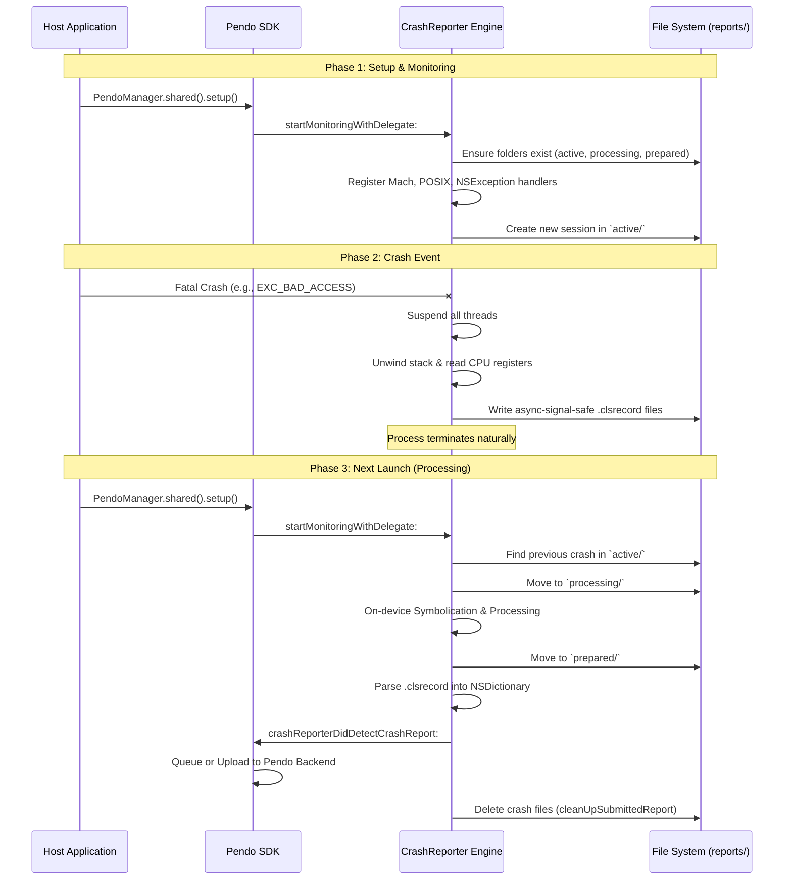

# Standalone Crashlytics Engine Architecture

This document provides a comprehensive architectural overview of the standalone crash-handling engine that was stripped from the Firebase Crashlytics SDK. It details how crashes are caught, how stack unwinding works, what data is collected securely during a crash, and how reports are processed and unified on the next application launch.

---

## 1. High-Level Overview

The standalone Crashlytics engine operates in two distinct phases:

*   **Phase 1: Crash Time (Execution)**
    Occurs when the app experiences a fatal event. The engine intercepts the crash, suspends all threads, unwinds the stack of the crashed thread (and all other threads), gathers device state and binary image information, and writes this data to disk. **Crucially, all operations in Phase 1 must be async-signal-safe.**
*   **Phase 2: Next Launch (Processing)**
    Occurs the next time the application starts. The engine detects reports left from previous sessions, parses the raw data, attempts on-device symbolication, and prepares a final unified report payload.

---

## 2. Initialization Flow

The engine has been decoupled from `FirebaseCore` and `FIRApp`. Initialization is now handled via a straightforward standalone method:

```objc
[FIRCrashlytics startMonitoringWithDelegate:self debugMode:NO];
```

### What happens during initialization:
1.  **File System Setup:** `FIRCLSFileManager` ensures the required directory structure exists (`active`, `processing`, `prepared`).
2.  **Context Setup:** `FIRCLSContextManager` initializes the central `FIRCLSContext`. The `FIRCLSContext` is a pre-allocated, write-protected memory region used to safely store critical application, device, and exception state. This guarantees that during a crash, no unsafe memory allocation (`malloc`) is required.
3.  **Phase 2 Trigger:** `FIRCLSReportManager` calls `checkAndUpdateUnsentReports` via `FIRCLSExistingReportManager` to process any crashes from a previous session.
4.  **Crash Handlers Installation:** The SDK registers its three tiers of exception handlers (Mach, POSIX, NSException/C++) simultaneously by invoking the `FIRCLSContextInitialize` C function, which dispatches the registration blocks to background queues.
5.  **Current Session Report Creation:** A new `.clsrecords` file is created in the `active` directory for the *current* execution.

---

## 3. Crash Capture Mechanisms (The 3 Tiers)

The engine employs a robust, three-tiered approach to ensure no crash goes unnoticed, regardless of where it originates.

### A. Mach Exceptions (`FIRCLSMachException.c`)
*   **What it catches:** Hardware-level faults (e.g., `EXC_BAD_ACCESS` for memory issues, `EXC_BAD_INSTRUCTION`, `EXC_GUARD`).
*   **How it works:** Mach exceptions are the lowest level of error reporting in macOS/iOS. The SDK creates a dedicated, high-priority background thread running a Mach message server (`mach_msg_server`). It uses `task_set_exception_ports` to route exception messages from the kernel to this dedicated thread.
*   **Advantage:** Because the exception is handled on a completely separate thread, the crashed thread is naturally suspended by the kernel, making stack unwinding incredibly reliable.

### B. POSIX Signals (`FIRCLSSignal.c`)
*   **What it catches:** OS-level signals (e.g., `SIGABRT` for aborts, `SIGSEGV` for segmentation faults, `SIGILL`, `SIGBUS`, `SIGFPE`).
*   **How it works:** Uses `sigaction` with the `SA_SIGINFO` flag to register a custom signal handler. When a signal occurs, the kernel interrupts the thread to execute the handler.
*   **Advantage:** Catches errors that may not trigger a Mach exception or catchable software exception, such as `abort()` calls or force-quits (if catchable).

### C. Language Exceptions (`FIRCLSException.mm`)
*   **What it catches:** Unhandled Objective-C exceptions (`NSException`) and unhandled C++ exceptions (`std::terminate`).
*   **How it works:**
    *   **Obj-C:** Registers an `NSUncaughtExceptionHandler`.
    *   **C++:** Replaces `std::set_terminate` with a custom handler.
*   **Advantage:** Allows the SDK to capture the actual exception object, reason, and name, providing much more context than just an instruction pointer fault.

### Exception Propagation & Preventing Double-Recording

Because of how iOS/macOS handles faults, a single crash can trigger multiple handlers in a cascading manner:
1. **Language Exceptions:** An unhandled `NSException` or C++ exception is caught by the language handler. After recording the crash, the handler typically allows the process to abort naturally (e.g., via `abort()`).
2. **Mach Exceptions vs. POSIX Signals:** If a hardware fault (like `EXC_BAD_ACCESS`) occurs, it is first caught by the **Mach Exception** handler. If the Mach exception is unhandled or intentionally forwarded, the XNU kernel translates it into a corresponding **POSIX Signal** (like `SIGSEGV` or `SIGBUS`) and delivers it to the thread, triggering the POSIX Signal handler. Similarly, calling `abort()` triggers `SIGABRT`.

To guarantee that a single crash isn't recorded multiple times (e.g., once by the NSException handler and again by the resulting `SIGABRT` signal handler), the `FIRCLSContext` maintains a strict atomic flag: `FIRCLSContext.crash.crashed`. 
* When *any* handler intercepts a crash, it immediately attempts an atomic compare-and-swap on this flag. 
* If the flag was already set by a previous handler in the chain, the secondary handler immediately bails out and allows the process to terminate. This ensures only the *original, most accurate* context of the crash is written to disk.

---

## 4. The Stack Unwinding Process (`FIRCLSUnwind.c`)

When a crash is intercepted, the engine must "unwind" the call stack to determine the sequence of function calls that led to the crash.

1.  **Thread Suspension:** If the crash was caught via a Signal or Exception, the handler immediately suspends all other threads in the process to freeze the application state.
2.  **Register State:** The engine retrieves the CPU registers (Instruction Pointer `pc`, Link Register `lr`, Frame Pointer `fp`, Stack Pointer `sp`) from the thread context (`ucontext_t` or Mach thread state).
3.  **Walking the Stack:**
    *   **Compact Unwind:** The engine first attempts to read the Compact Unwind Info (a highly optimized table stored in the Mach-O binary) to determine how to restore the registers for the previous frame.
    *   **DWARF Unwind:** If Compact Unwind fails or isn't present, it falls back to parsing DWARF `.eh_frame` data.
    *   **Frame Pointer Heuristic:** As a last resort (or for older architectures), it walks the stack using the Frame Pointer (`fp`) chain.
4.  **Recording:** For each frame, it records the memory address (Program Counter / `pc`).

---

## 5. Async-Signal-Safe Data Collection (Phase 1)

**The Golden Rule of Crash Handlers:** Once an app has crashed, memory is in an undefined state. You cannot allocate memory (`malloc`), you cannot use Objective-C/Swift objects, and you cannot use standard locks (`dispatch_sync`, `@synchronized`), as doing so will cause deadlocks.

To safely record data during a crash, the SDK relies on:
*   **Pre-allocated Memory:** `FIRCLSContext` pre-allocates memory for the crash state during initialization.
*   **`FIRCLSSDKFileLog`:** A custom logging macro that uses raw C string formatting and writes directly to a file descriptor using the `write()` syscall.
*   **Append-Only `.clsrecords`:** The engine writes data to disk in a proprietary append-only format (`.clsrecords`).

### What is collected:
*   **Crash Metadata:** Timestamp, crashing thread ID, exception type/code/reason.
*   **Thread States:** The unwound stack frames (addresses) and register values for *all* threads.
*   **Binary Images:** A list of all dynamically loaded libraries (Mach-O images) in the process, their load addresses, sizes, and **UUIDs**. (Crucial for later symbolication).
*   **Device/App Info:** OS version, device model, free RAM/disk, app version, orientation.
*   **Custom Data:** Any custom keys, logs, or user IDs previously recorded by the developer (stored safely in memory-mapped files during normal execution).

---

## 6. Phase 2: Next Launch Unification & Processing

Because a crashed process cannot safely format a complex JSON payload or make network requests, that work is deferred to the next time the app launches.

### Step A: Discovery (`FIRCLSExistingReportManager`)
1.  On startup, the manager scans the `reports/active/` directory.
2.  It identifies directories belonging to previous sessions.
3.  It groups the raw `.clsrecords` files written during the crash.

### Step B: Processing & On-Device Symbolication (`FIRCLSReportUploader` & `FIRCLSProcessReportOperation`)
1.  The raw report directory is moved from `active/` to **`processing/`**.
2.  `FIRCLSProcessReportOperation` is executed on a background queue.
3.  **Parsing:** It parses the raw, fragmented `.clsrecords` files.
4.  **Symbolication (`FIRCLSSymbolResolver`):** It attempts basic on-device symbolication. It compares the raw memory addresses of the stack frames against the loaded Binary Images to calculate the exact offset within the binary.
5.  **Formatting:** It consolidates the thread data, exception data, and binary images into a structured internal object (`FIRCLSInternalReport`).

### Step C: Prepared State
1.  Once the processing operation is complete, the report directory is moved from `processing/` to **`prepared/`**.
2.  *In the original Firebase SDK, this is the exact moment `GoogleDataTransport` was invoked to upload the payload.*
3.  **In our Standalone Engine:** The report halts here. The processed files rest safely in the `reports/prepared/` directory, ready to be read, extracted, or transmitted by your custom host application logic.

---

## 7. Folder Structure and File Saving

On startup, when `FIRCrashlytics startWithDeviceID:` is called, the `FIRCLSFileManager` guarantees the existence of a base cache directory (typically `~/Library/Caches/com.crashlytics.data/{bundle_id}/v5/reports/`). 
It actively creates three main subdirectories:

1.  **`active/`**: This is where the *current* session's data is written. On startup, a new folder is created here named after the unique `executionIdentifier` (e.g., `active/1234-5678-ABCD/`).
2.  **`processing/`**: When the app launches *after* a crash, the previous session's folder from `active/` is moved here to be parsed and symbolicated on a background thread.
3.  **`prepared/`**: Once processing is complete, the final structured files are moved here.

### Files Saved During a Crash

When a crash occurs, the engine synchronously writes multiple separate files directly into the `active/{executionIdentifier}/` directory. The crash state is fragmented into these specific files because different handlers (Mach, POSIX, NSException) log different pieces of data, and keeping them separate avoids complex lock management.

Common files written during a crash include:
*   `metadata.clsrecord`: Basic device info, OS version, and session identity.
*   `binary_images.clsrecord`: The list of loaded Mach-O images and their UUIDs (crucial for symbolication).
*   `exception.clsrecord`: Stack traces and reasons for `NSException` and C++ exceptions.
*   `mach_exception.clsrecord`: Thread states and registers for Mach-level faults.
*   `signal.clsrecord`: Thread states and registers for POSIX signals.

### The `.clsrecord` File Extension

`.clsrecord` is simply a custom file extension chosen by the Crashlytics team. It does not represent a proprietary binary format. The actual content inside these files is standard text, specifically **JSON-Lines (NDJSON)**.

*   **Why write text during a crash?** Standard JSON libraries (like `NSJSONSerialization`) allocate memory (`malloc`) and use Objective-C objects, making them **unsafe** to use during a crash. Crashlytics needs to write structured data safely without triggering a secondary deadlock.
*   **How it works:** The engine uses custom, low-level C functions (e.g., `FIRCLSFileWriteSectionStart`, `FIRCLSFileWriteHashEntryString`) which manually format raw C-strings to look like JSON and write them to disk using raw `write()` system calls. This plain-text writing is async-signal-safe.
*   **Phase 2 Parsing:** Because the raw text was written using valid JSON syntax, when the app restarts (Phase 2), Crashlytics can simply read the text file, split it by `\n`, and hand each line directly to Apple's highly optimized `NSJSONSerialization` to reconstruct the complex dictionary hierarchies.

Example of `.clsrecord` contents:
```json
{"identity":{"session_id":"1234-ABCD","started_at":167888}}
{"application":{"bundle_id":"com.pendo.example"}}
```

---

## 8. Pendo SDK Integration & Delegate Flow

Unlike the original Firebase SDK which automatically uploaded the processed crash to Google's backend, our standalone fork operates via a strict delegate pattern.

1. **Initialization**: The Pendo SDK (`PNDCrashReportingManager`) calls `[FIRCrashlytics startMonitoringWithDelegate:self debugMode:NO]` synchronously on the main thread during `PendoManager` setup.
2. **Parsing**: When `FIRCLSReportUploader` finishes moving a report to the `prepared/` directory, it immediately parses the fragmented `.clsrecord` files.
3. **Dictionary Flattening**: The engine merges the JSON-Lines and KV (Key-Value) files into a single, cohesive `NSDictionary` containing the full crash context (threads, exceptions, binary images, and custom data).
4. **Delegate Callback**: It fires `[delegate crashReporterDidDetectCrashReport:parsedReport]` on the main thread, handing the dictionary to the Pendo SDK.
5. **Cleanup**: Immediately after the delegate returns, the engine deletes the crash report files from the disk using `removeItemAtPath:` to prevent stale data accumulation.

---

## 9. Symbol Collision Prevention

To ensure that an app can safely install both the **Pendo SDK** (with our crash engine) and the full **Firebase SDK** without encountering duplicate symbol linker errors, we implemented a C-preprocessor macro prefixing system.

*   A master prefix header (`PNDCrashReporter+Namespace.h`) is included in the umbrella header.
*   It uses `#define` to map every public and internal Objective-C class, struct, and constant from `FIR*` to `PND_FIR*` at compile time (e.g., `#define FIRCrashlytics PND_FIRCrashlytics`).
*   This ensures that the symbols compiled into our library are totally isolated from any Firebase components the host app might be using.

---

## 10. Architecture Flow Diagram

Below is a sequence diagram illustrating the complete lifecycle from initialization, to crash, to the subsequent launch where the report is processed and passed to Pendo.

